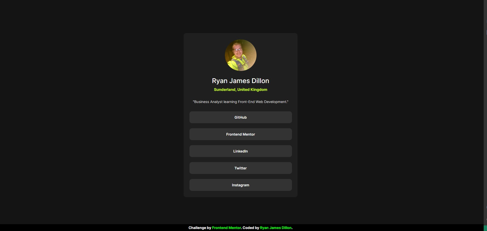
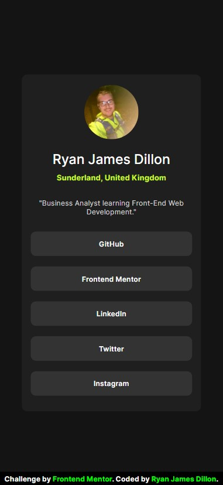

# Frontend Mentor - Social links profile solution

This is a solution to the [Social links profile challenge on Frontend Mentor](https://www.frontendmentor.io/challenges/social-links-profile-UG32l9m6dQ). Frontend Mentor challenges help you improve your coding skills by building realistic projects.

## Table of contents

- [Overview](#overview)
  - [The challenge](#the-challenge)
  - [Screenshot](#screenshot)
  - [My process](#my-process)
  - [Built with](#built-with)
  - [What I learned](#what-i-learned)
  - [Continued development](#continued-development)
  - [Author](#author)

## Overview

- Second project on Front-end Mentor. Completed this one on the laptop and found it much much easier to make the page responsive.

### The challenge

Users should be able to:

- See hover and focus states for all interactive elements on the page

### Screenshot

- 
- 

## My process

- Started with the basic HTML.
- Created the divs based on the provided content.
- Styled the outlines of the divs and gave them borders for debugging.
- updated the image to my own.
- Got stuck with the <a> as forgot about them so had to google anchor tags.
- Struggled to get the <a> tags to work, tried just using 
 tags with anchors in them but eventually figured it out.
- built with browser first.
- downscaled using media query.

### Built with

- VSCode
- HTML
- CSS

### What I learned

- Much easier using a laptop to build, as expected.
- Using auto for height/width is a great way to be responsive!

### Continued development

- Practice needed from scratch

## Author

- Ryan Dillon
